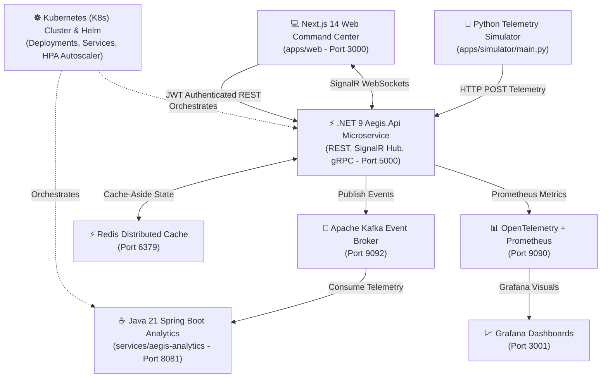
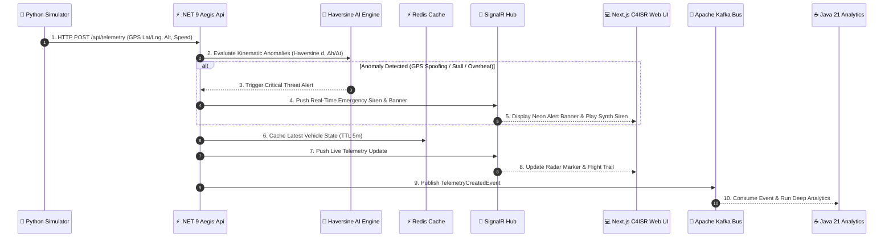

# 🛡️ AEGIS: Enterprise C4ISR Tactical Telemetry & Cloud-Native Air Defense Platform

[](https://dotnet.microsoft.com/)
[](https://www.oracle.com/java/)
[](https://spring.io/projects/spring-boot)
[](https://nextjs.org/)
[](https://kafka.apache.org/)
[](https://redis.io/)
[](https://kubernetes.io/)
[](https://helm.sh/)
[](https://opentelemetry.io/)
[](https://xunit.net/)
[](LICENSE)

> **AEGIS** (*Greek for "Shield of the Gods"*) is an enterprise-grade, cloud-native **C4ISR (Command, Control, Communications, Computers, Intelligence, Surveillance, and Reconnaissance)** tactical telemetry and air defense platform. Built with **Clean Architecture**, **Event-Driven Microservices**, **Statistical AI Anomaly Detection**, and **Zero-Trust Security**, AEGIS tracks unmanned aerial vehicles (UAVs), search & rescue teams, and emergency vehicles in real-time.

---

## 🏛️ System Architecture & Data Flow

### 1. High-Level Architecture


### 2. Real-Time Telemetry & Threat Sequence Flow


---

## 💡 Real-World IoT & Edge Hardware Deployment (Gerçek Dünyada Nasıl Çalışır?)

In a live production defense or emergency response deployment (such as a **Bayraktar TB2**, **STM KARGU-2 UAV**, or **AFAD Emergency Ambulance**), physical edge hardware is mounted inside the vehicle:

```
┌────────────────────────────────────────────────────────────────────────────────────────┐
│                        REAL-WORLD TACTICAL VEHICLE EDGE HARDWARE                       │
│                                                                                        │
│   ┌───────────────────┐    GPS/NMEA Data   ┌──────────────────────────────────────┐    │
│   │ 🛰️ NEO-M8N / GPS  ├───────────────────►│  🧠 STM32 / PX4 Autopilot / Pi CM4   │    │
│   │    GNSS Antenna   │                    │     (Onboard Flight Controller)      │    │
│   └───────────────────┘                    └──────────────────┬───────────────────┘    │
│                                                               │ Encrypted Telemetry    │
│                                                               ▼ (MAVLink / Protobuf)   │
│   ┌───────────────────┐                    ┌──────────────────────────────────────┐    │
│   │ 🔋 BMS & Thermal  ├───────────────────►│  📡 4G/5G LTE / SATCOM GPRS Modem    │    │
│   │    Power Sensors  │  Battery & Temp    │     (Quectel / Sierra Wireless)      │    │
│   └───────────────────┘                    └──────────────────┬───────────────────┘    │
└───────────────────────────────────────────────────────────────┼────────────────────────┘
                                                                │ Encrypted Payload
                                                                │ (HTTPS / gRPC Stream)
                                                                ▼
                                            ┌──────────────────────────────────────┐
                                            │  🛡️ AEGIS C4ISR COMMAND CENTER API   │
                                            │   (.NET 9 Microservice - Port 5000)  │
                                            └──────────────────────────────────────┘
```

### 🔹 Physical Hardware Layer (Fiziksel Donanım Katmanı)
1. **🧠 Onboard IoT Flight Controller / Edge Computer:**
   - Powered by an **STM32F4/F7 Microcontroller**, **PX4 Autopilot Board**, or **Raspberry Pi Compute Module 4 (CM4)** running lightweight C++/Python firmware.
2. **🛰️ High-Precision GNSS Receiver:**
   - Onboard U-Blox NEO-M8N / ZED-F9P GPS antennas fetch real-time latitude, longitude, altitude (MSL), and ground speed every **1–2 seconds**.
3. **🔋 Battery Management System (BMS) & Thermal Sensors:**
   - Measures cell voltage, state-of-charge percentage (%), and core motor temperature.
4. **📡 Cellular 4G/5G & Satellite Datalink (SATCOM):**
   - Transmits telemetry JSON / Protocol Buffer packets over encrypted 4G/5G GPRS modems or SATCOM datalinks to the AEGIS central server.

---

### 🔹 Digital Twin & Software Simulation (Yazılım Dijital İkizi)
In this repository, [`apps/simulator/main.py`](apps/simulator/main.py) serves as a **Software Digital Twin** of these physical **STM32 / PX4 Edge Hardware Boards**. It mathematically simulates real-world flight dynamics, battery drain, thermal heating, and satellite coordinates, transmitting live telemetry to the AEGIS .NET 9 API exactly as physical IoT hardware would in an operational mission.

---

## ✨ Key Platform Capabilities

### 1. 🤖 Statistical AI Kinematic Anomaly Detector
Unlike heavy neural networks that introduce millisecond latency, AEGIS incorporates a high-speed **Haversine Earth Kinematic Model** ($d = 2R \cdot \text{atan2}(\sqrt{a}, \sqrt{1-a})$) in C# ([`StatisticalAnomalyDetector.cs`](services/aegis-api/src/Aegis.Application/Telemetry/Services/StatisticalAnomalyDetector.cs)) executing in under **0.1ms** to detect 3 critical aerial threats:
- **🛰️ GPS Spoofing & Signal Jamming:** Detects impossible spatial jumps ($v > 1200\text{ km/h}$) caused by enemy electronic warfare (EW).
- **📉 Sudden Altitude Freefall (Stall / Wing Damage):** Triggers immediate drop alarms when vertical fall rate exceeds $\Delta h / \Delta t > 100\text{ m/s}$.
- **🔥 Thermal Runaway (Battery / Engine Fire Risk):** Flags rapid thermal spikes ($\Delta T / \Delta t > 2.5^\circ\text{C/s}$) before structural battery failure.

### 2. 🗺️ Real-Time GIS & Official ICAO/AIP No-Fly Zone Geofencing
- **🇹🇷 Turkish Defense Industry Platforms:** Real-time stream processing for STM KARGU-2 (Tactical Loitering Attack UAV), STM TOGAN-2 (Autonomous Reconnaissance UAV), STM ALPAGU-1 (Loitering Munition), and TSK Rescue Helicopters.
- **GIS Cartography:** Integrates Esri Dark Gray, Esri Satellite Imagery, and OpenStreetMap tiles without proprietary API keys.
- **Official Airspace Polygons:** Renders Turkish Aeronautical Information Publication (AIP) restricted airspace polygons:
  - **🚫 LT-P1:** Ankara Protocol & Anıtkabir Prohibited Area
  - **⚠️ LT-R4:** Ankara Mürted / Akıncı Military Airbase Restricted Area
  - **🚫 LT-P12:** İzmir Çiğli 2nd Main Jet Base Prohibited Airspace
- **Neon Breadcrumb Trails:** Displays dynamic 50-point flight history trails for tracked units.

### 3. 🔐 Zero-Trust Security & Role-Based Access Control (RBAC)
- **256-Bit HMAC-SHA256 JWT Bearer Authentication** with strict role scoping:
  - `Operator`: Full read, write, manual alert broadcasting, and alarm acknowledgement access.
  - `Device`: High-throughput telemetry ingestion role used by UAV autopilots.
  - `Guest`: Read-only tactical observation mode.
- **Cinematic C4ISR Login Gate:** Zero-trust entrance portal blocking unauthenticated access to live tactical geometry.

### 4. 🎛️ Tactical Command Add-ons
- **🔊 Web Audio API Tactical Sirens:** Real-time dual-tone synth radar alarms ($880\text{Hz} \rightarrow 440\text{Hz}$) synthesized natively in the browser without external media assets.
- **🚨 Manual Operator Emergency Broadcast:** Single-click operator panel ([`ManualAlertModal.tsx`](apps/web/src/components/ManualAlertModal.tsx)) to broadcast custom alerts to all connected screens.
- **⏯️ Interactive Flight History Replay Player:** Time-slider playback bar with 1x, 2x, 4x speed control that smoothly animates vehicle markers along historical flight points.
- **📄 After-Action Report (AAR) Export:** 1-click CSV exporter for mission debriefing and telemetry audit trails.

### 5. 🔍 Live Asset Search, Filter & Role-Isolated Consoles
- **Live Search & Filter:** Filter thousands of fleet tracks instantly by unit name, track ID, or vehicle type (`[ALL]`, `[DRONE]`, `[HELICOPTER]`, `[AMBULANCE]`).
- **1-Click "PLAY ON MAP" Action:** Single click on any unit card in the fleet console smoothly transitions to the GIS map view and initiates real-time flight route playback.
- **Dedicated C4ISR Workspaces:** Distinct tab isolation for Command Overview (Dashboard), Fullscreen Map, Asset Console, AI Anomaly Engine, and Mission Debriefing (Reports).

### 6. ☸️ Cloud-Native Infrastructure & Resilience
- **Kubernetes (K8s) & Helm v3.0.0:** Production deployment manifests ([`deployments/k8s/`](deployments/k8s/)), ClusterIP services, and Horizontal Pod Autoscaler (HPA) scaling pods dynamically based on CPU (>70%) and RAM (>80%).
- **Polly Resilience Pipelines:** Exponential backoff retries and circuit breakers preventing cascaded failure during Redis/Kafka container outages.
- **Observability Stack:** OpenTelemetry metric instrumentation scraped by Prometheus (`http://localhost:9090`) and visualized via Grafana (`http://localhost:3001`).

---

## 🛠️ Technology Stack

| Layer / Domain | Technology & Version | Description |
| :--- | :--- | :--- |
| **Backend Core** | C# .NET 9.0 (ASP.NET Core) | Clean Architecture solution (`Domain`, `Application`, `Infrastructure`, `Api`) |
| **Analytics Engine** | Java 21 / Spring Boot 3.x | Kafka Listener Microservice (`services/aegis-analytics`) |
| **Frontend Web** | Next.js 14 / TypeScript / TailwindCSS | Tactical Control Center (`apps/web`) |
| **Real-Time Streaming** | ASP.NET Core SignalR WebSockets | Bi-directional telemetry and alert broadcasting |
| **Binary RPC** | gRPC & Protobuf (`telemetry.proto`) | High-speed binary telemetry service |
| **Event Streaming** | Apache Kafka 7.5.0 & Zookeeper | Event-driven telemetry event bus |
| **Distributed Cache** | Redis 7.0 (Alpine) | Cache-aside pattern for vehicle location states |
| **Database** | PostgreSQL 16 & EF Core | Persistent storage for vehicles, alerts, and logs |
| **Observability** | OpenTelemetry / Prometheus / Grafana | Metrics scraping at `/metrics` & Grafana dashboards |
| **Orchestration** | Kubernetes v1.36 / Helm v3.0.0 | HPA Autoscaling & Cloud-Native Deployment |
| **Testing** | xUnit / Moq | 24 passing unit test suites |

---

## 📂 Repository & Directory Structure

```
AEGIS/
├── 📁 apps/
│   ├── 📁 simulator/              # Python Real-Time Telemetry & Digital Twin Simulator
│   │   ├── main.py                # Flight telemetry loop & STM vehicle registration
│   │   └── vehicle_simulator.py   # GPS, altitude, battery & thermal kinematic model
│   └── 📁 web/                    # Next.js 14 C4ISR Tactical Web Command Center
│       ├── 📁 src/
│       │   ├── 📁 app/            # App Router (page.tsx, layout.tsx, C4ISR login gate)
│       │   ├── 📁 components/     # LiveRadarMap, VehicleList, RouteReplayPlayer, Header, etc.
│       │   ├── 📁 lib/            # SignalR client, Web Audio sirens, JWT auth helpers
│       │   └── 📁 types/          # TypeScript telemetry & alert interfaces
│       └── package.json
├── 📁 services/
│   ├── 📁 aegis-api/              # .NET 9 ASP.NET Core C4ISR Backend Microservice
│   │   ├── 📁 src/
│   │   │   ├── 📁 Aegis.Api/             # Controllers, SignalR Hub, gRPC Telemetry Service
│   │   │   ├── 📁 Aegis.Application/     # CQRS, Telemetry & Anomaly Services, DTOs
│   │   │   ├── 📁 Aegis.Domain/          # Entities (Vehicle, Alert), Value Objects, Enums
│   │   │   └── 📁 Aegis.Infrastructure/  # EF Core, Redis Cache, Kafka Producer, JWT
│   │   └── 📁 tests/                     # xUnit Unit & Integration Test Suites (24/24 PASS)
│   └── 📁 aegis-analytics/        # Java 21 / Spring Boot 3 Kafka Analytics Listener
├── 📁 deployments/
│   ├── 📁 k8s/                    # Kubernetes Deployment, Service & HPA Manifests
│   └── 📁 helm/                   # Helm v3.0.0 Production Chart
├── 📁 docs/                        # Architecture documentation & walkthrough chapters
├── docker-compose.yml             # Local Multi-Container Infrastructure Stack
└── README.md                      # Primary Project Documentation
```

---

## 🚀 Quick Start Guide

### Option A: 1-Click Full-Stack Docker Deployment (Recommended)
Launch the entire AEGIS platform (PostgreSQL, Redis, Kafka, Prometheus, Grafana, .NET 9 API, Next.js Command Center, and Python Simulator) in isolated containers with a single command:

```bash
git clone https://github.com/your-username/aegis.git
cd aegis

# Build & launch all services simultaneously
docker compose up --build
```
*Access the Web Command Center at `http://localhost:3000` (API at `http://localhost:5000`). Once built, you can start/stop the stack with a single click using the **Play ▶️ / Stop ⏹️** button in Docker Desktop.*

---

### Option B: Multi-Machine / Remote Backend Environment Setup
If your Frontend and Backend services are hosted on separate physical machines or different IP addresses across your local network:
1. Create a `.env.local` file inside `apps/web/`:
   ```env
   NEXT_PUBLIC_API_URL=http://<BACKEND-IP-OR-DOMAIN>:5000/api
   NEXT_PUBLIC_SIGNALR_URL=http://<BACKEND-IP-OR-DOMAIN>:5000/hubs/telemetry
   ```
   *Note: By default, AEGIS features intelligent dynamic host resolution (`getApiBaseUrl()`), automatically detecting your network IP when accessing via local Wi-Fi.*

---

### Option C: Local Development Mode (Individual Services)

#### Prerequisites
- [.NET 9.0 SDK](https://dotnet.microsoft.com/download/dotnet/9.0)
- [Java 21 JDK](https://adoptium.net/) & Maven
- [Node.js 18+ & npm](https://nodejs.org/)
- [Python 3.10+](https://www.python.org/) (`requests` package installed)
- [Docker Desktop](https://www.docker.com/products/docker-desktop/)

#### Step 1: Start Infrastructure Stack
```bash
docker compose up -d
```

#### Step 2: Start C# .NET 9 API Backend
```bash
cd services/aegis-api
dotnet run --project src/Aegis.Api
```

#### Step 3: Start Next.js Web Command Center
```bash
cd apps/web
npm install
npm run dev
```

#### Step 4: Start Python Telemetry Simulator
```bash
python apps/simulator/main.py
```
*The simulator will register official Turkish defense tactical platforms (**STM-KARGU-2**, **STM-TOGAN-2**, **STM-ALPAGU-1**, **TSK-HELS-35**, **AFAD-AMBULANS-06**) and stream live STANAG 4586 compliant GPS coordinates to the API.*

---

## 🔑 Test Credentials (JWT Roles)

| Role | Username | Password | Permissions |
| :--- | :--- | :--- | :--- |
| **🛡️ Operator** | `operator` | `Password123!` | **Full Access** (Acknowledge alerts, broadcast manual alarms) |
| **🛰️ Device** | `device` | `Password123!` | **Telemetry Ingestion** (UAV autopilot role) |
| **👁️ Guest** | `guest` | `Password123!` | **Read-Only** (Observation mode) |

---

## ☸️ Kubernetes & Helm Deployment

Deploy the entire AEGIS platform to any Kubernetes cluster (Docker Desktop K8s, Minikube, AWS EKS, Google GKE, Azure AKS) with standard manifests:

```bash
# 1. Create aegis-system namespace
kubectl create namespace aegis-system

# 2. Build local Docker images
docker build -t aegis-api:v3.0.0 -f services/aegis-api/Dockerfile .
docker build -t aegis-analytics:v3.0.0 -f services/aegis-analytics/Dockerfile .

# 3. Apply Kubernetes Manifests (Deployments, Services, HPA)
kubectl apply -f deployments/k8s/

# Or install via Helm Chart
helm install aegis ./deployments/helm/aegis
```

### Inspect Kubernetes Status
```bash
# List running Pods
kubectl get pods -n aegis-system

# List Services
kubectl get svc -n aegis-system

# View Horizontal Pod Autoscaler
kubectl get hpa -n aegis-system
```

---

## 🧪 Automated Testing

Execute the xUnit test suite covering Domain Entities, Value Objects, Repositories, Alert Engine, and the Statistical AI Anomaly Detector:

```bash
cd services/aegis-api
dotnet test Aegis.sln
```

**Test Results:** `Total tests: 24. Passed: 24. Failed: 0. Skipped: 0. Süre: 976 ms.`

---

## 📄 License

This project is licensed under the **MIT License** - see the [LICENSE](LICENSE) file for details.

---

<p center="align">
  <strong>AEGIS Tactical Command Engineering Team</strong> • Built with ❤️ for Cloud-Native Defense Tech
</p>
