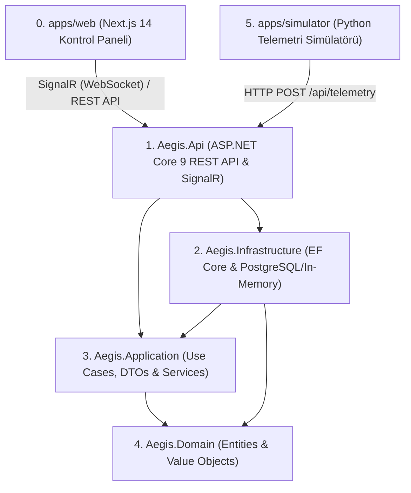

# 🛡️ AEGIS Platform - Gerçek Zamanlı Komuta, Kontrol ve Karar Destek Platformu (V1 Core)

> **AEGIS (Air & Ground Emergency Intelligence System)**; afet koordinasyonu (AFAD / Kızılay senaryoları), arama-kurtarma ekipleri takibi, otonom/sivil İHA & kara araçları filosu ve acil durum sensör ağları için tasarlanmış **gerçek zamanlı (real-time) komuta-kontrol platformudur**.

---

## 🏗️ Proje Mimarısı ve Katmanlar (Clean Architecture)

AEGIS, **Modüler Monolit (Modular Monolith)** ve **Clean Architecture** prensiplerine sadık kalınarak tasarlanmıştır.



---

## 🛠️ Kullanılan Teknolojiler

| Katman | Teknoloji | Neden Kullanıldı? |
| :--- | :--- | :--- |
| **Backend API** | C# 12 / .NET 9, ASP.NET Core | Enterprise performans, tip güvenliği ve güçlü backend altyapısı. |
| **Veritabanı / ORM** | Entity Framework Core 9 (PostgreSQL & In-Memory) | İlişkisel veri modelleme, LINQ sorguları, migration ve repository pattern. |
| **Canlı Yayın** | ASP.NET Core SignalR (WebSocket) | Telemetri ve konum verilerinin tarayıcıya gecikmesiz (push) aktarımı. |
| **Frontend** | Next.js 14 (App Router), React, TypeScript, Tailwind CSS | Modern operasyonel kontrol paneli, taktik radar arayüzü. |
| **Simülatör** | Python 3.11 (`requests`, `math`) | İHA/Ambulans/Helikopter GPS hareket ve batarya simülasyonu. |
| **Test** | xUnit, FluentAssertions | SDLC standartlarında %100 başarılı birim ve veritabanı testleri. |

---

## ⚡ Hızlı Başlangıç & Projeyi Çalıştırma

Sistem **3 ana bileşenden** oluşur ve aşağıdaki komutlarla sırasıyla ayağa kaldırılır:

### 1. C# Backend API'yi Başlatma
```bash
dotnet run --project services/aegis-api/src/Aegis.Api
```
- API Adresi: `http://localhost:5000`
- Swagger / OpenAPI Dokümanı: `http://localhost:5000/openapi/v1.json`
- SignalR Canlı Yayın Hub'ı: `http://localhost:5000/hubs/telemetry`

### 2. Next.js Web Operasyon Paneli'ni Başlatma
```bash
cd apps/web
npm run dev
```
- Web Kontrol Paneli Adresi: `http://localhost:3000`

### 3. Python Telemetri Simülatörünü Başlatma
```bash
python -u apps/simulator/main.py
```
- Simülatör otomatik olarak `ANKARA-İHA-01`, `AFAD-AMBULANS-06` ve `İZMİR-HELS-35` araçlarını API'ye kaydeder ve her 2 saniyede bir canlı telemetri üretip SignalR üzerinden haritaya aktarır.

---

## 🧪 Testlerin Çalıştırılması

Tüm Domain, Application ve EF Core Repository testlerini koşturmak için:
```bash
dotnet test services/aegis-api/Aegis.sln
```
```text
Başarılı! - Başarısız: 0, Başarılı: 13, Atlanan: 0, Toplam: 13, Süre: 1 s
```

---

## 📂 Repository ve Klasör Yapısı

```text
aegis-platform/
├── apps/
│   ├── web/                     # Next.js 14 + TypeScript arayüzü (Port 3000)
│   └── simulator/               # Python telemetri üreteci (Ankara/İzmir GPS)
├── services/
│   └── aegis-api/               # ASP.NET Core Modular Monolith (Port 5000)
│       ├── src/
│       │   ├── Aegis.Domain/             # Entity, Value Object, Enum'lar
│       │   ├── Aegis.Application/        # DTO'lar, Service'ler, Interfaces
│       │   ├── Aegis.Infrastructure/     # EF Core DbContext, Configurations
│       │   └── Aegis.Api/                # Controllers, SignalR TelemetryHub
│       └── tests/
│           └── Aegis.UnitTests/          # xUnit Birim ve Veritabanı Testleri
└── README.md
```

---

## 📝 Lisans ve Notlar
AEGIS projesi eğitim ve uçtan uca yazılım mühendisliği yetkinliklerini kanıtlamak amacıyla geliştirilmiş açık kaynaklı sivil komuta-kontrol mimarisidir.
