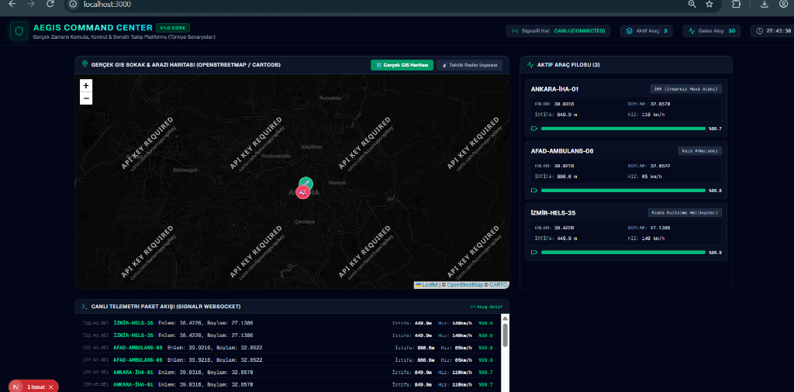
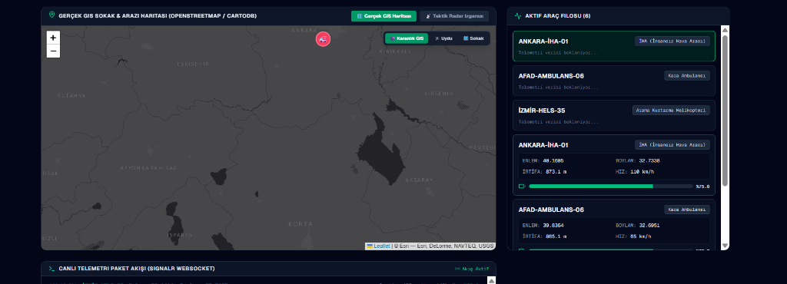
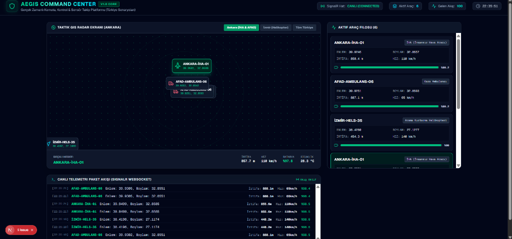
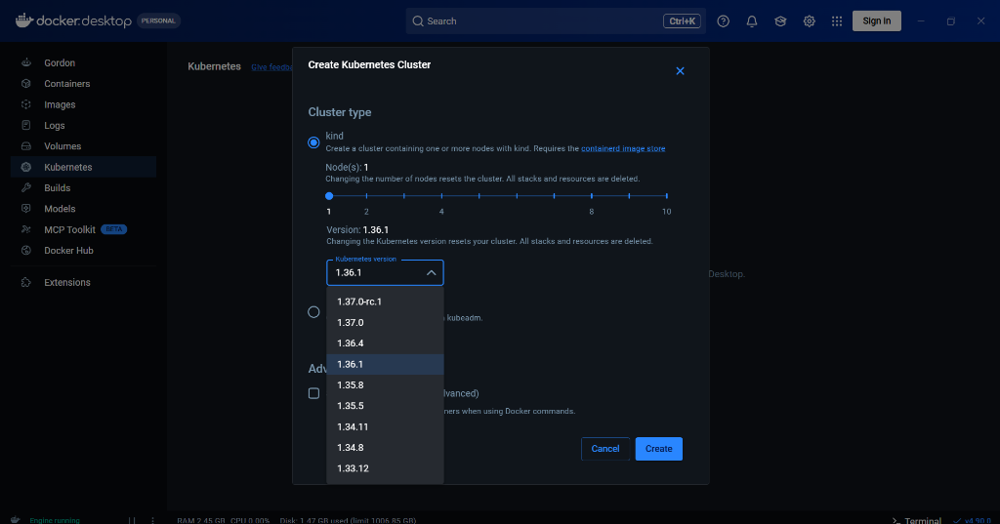
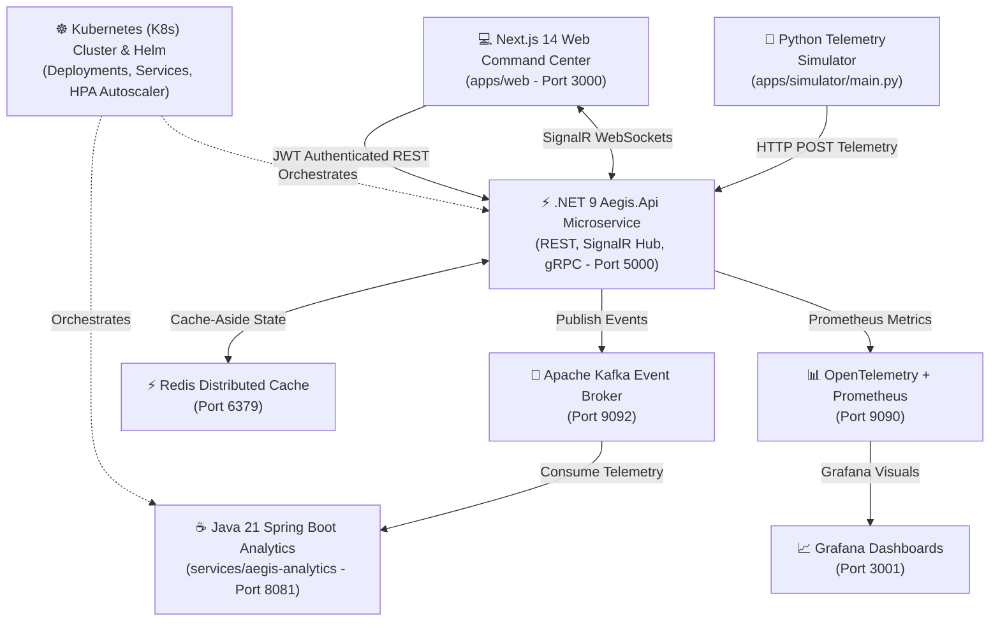
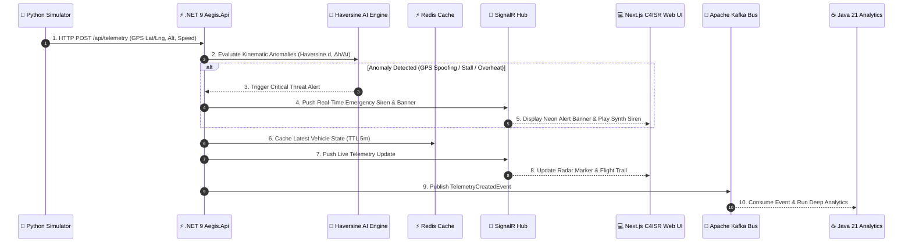

# 🛡️ AEGIS: Enterprise C4ISR Tactical Telemetry & Cloud-Native Air Defense Platform

[](https://dotnet.microsoft.com/)
[](https://www.oracle.com/java/)
[](https://spring.io/projects/spring-boot)
[](https://nextjs.org/)
[](https://kafka.apache.org/)
[](https://redis.io/)
[](https://kubernetes.io/)
[](https://helm.sh/)
[](https://opentelemetry.io/)
[](https://xunit.net/)
[](LICENSE)

> **AEGIS** (*Greek for "Shield of the Gods"*) is an enterprise-grade, cloud-native **C4ISR (Command, Control, Communications, Computers, Intelligence, Surveillance, and Reconnaissance)** tactical telemetry and air defense platform. Built with **Clean Architecture**, **Event-Driven Microservices**, **Statistical AI Anomaly Detection**, and **Zero-Trust Security**, AEGIS tracks unmanned aerial vehicles (UAVs), search & rescue teams, and emergency vehicles in real-time.

---

## 📸 Tactical Radar System Visual Overview

| Tactical Command Center & GIS Flight Trails | Live Radar Grid & Vehicle List |
| :---: | :---: |
|  |  |

| Tactical Alert Banner & AI Anomaly Detection | Kubernetes Cloud-Native Cluster Setup |
| :---: | :---: |
|  |  |

---

## 🏛️ System Architecture & Data Flow

### 1. High-Level Architecture


### 2. Real-Time Telemetry & Threat Sequence Flow


---

## ✨ Key Platform Capabilities

### 1. 🤖 Statistical AI Kinematic Anomaly Detector
Unlike heavy neural networks that introduce millisecond latency, AEGIS incorporates a high-speed **Haversine Earth Kinematic Model** ($d = 2R \cdot \text{atan2}(\sqrt{a}, \sqrt{1-a})$) in C# ([`StatisticalAnomalyDetector.cs`](file:///c:/Users/Dell/Documents/PROJECT/AEGIS/services/aegis-api/src/Aegis.Application/Telemetry/Services/StatisticalAnomalyDetector.cs)) executing in under **0.1ms** to detect 3 critical aerial threats:
- **🛰️ GPS Spoofing & Signal Jamming:** Detects impossible spatial jumps ($v > 1200\text{ km/h}$) caused by enemy electronic warfare (EW).
- **📉 Sudden Altitude Freefall (Stall / Wing Damage):** Triggers immediate drop alarms when vertical fall rate exceeds $\Delta h / \Delta t > 100\text{ m/s}$.
- **🔥 Thermal Runaway (Battery / Engine Fire Risk):** Flags rapid thermal spikes ($\Delta T / \Delta t > 2.5^\circ\text{C/s}$) before structural battery failure.

### 2. 🗺️ Real-Time GIS & Official ICAO/AIP No-Fly Zone Geofencing
- **GIS Cartography:** Integrates Esri Dark Gray, Esri Satellite Imagery, and OpenStreetMap tiles without proprietary API keys.
- **Official Airspace Polygons:** Renders Turkish Aeronautical Information Publication (AIP) restricted airspace polygons:
  - **🚫 LT-P1:** Ankara Protocol & Anıtkabir Prohibited Area
  - **⚠️ LT-R4:** Ankara Mürted / Akıncı Military Airbase Restricted Area
  - **🚫 LT-P12:** İzmir Çiğli 2nd Main Jet Base Prohibited Airspace
- **Neon Breadcrumb Trails:** Displays dynamic 50-point flight history trails for tracked units.

### 3. 🔐 Zero-Trust Security & Role-Based Access Control (RBAC)
- **256-Bit HMAC-SHA256 JWT Bearer Authentication** with strict role scoping:
  - `Operator`: Full read, write, manual alert broadcasting, and alarm acknowledgement access.
  - `Device`: High-throughput telemetry ingestion role used by UAV autopilots.
  - `Guest`: Read-only tactical observation mode.
- **Cinematic C4ISR Login Gate:** Zero-trust entrance portal blocking unauthenticated access to live tactical geometry.

### 4. 🎛️ Tactical Command Add-ons
- **🔊 Web Audio API Tactical Sirens:** Real-time dual-tone synth radar alarms ($880\text{Hz} \rightarrow 440\text{Hz}$) synthesized natively in the browser without external media assets.
- **🚨 Manual Operator Emergency Broadcast:** Single-click operator panel ([`ManualAlertModal.tsx`](file:///c:/Users/Dell/Documents/PROJECT/AEGIS/apps/web/src/components/ManualAlertModal.tsx)) to broadcast custom alerts to all connected screens.
- **⏯️ Interactive Flight History Replay Player:** Time-slider playback bar with 1x, 2x, 4x speed control that smoothly animates vehicle markers along historical flight points.
- **📄 After-Action Report (AAR) Export:** 1-click CSV exporter for mission debriefing and telemetry audit trails.

### 5. 🔍 Live Asset Search, Filter & Role-Isolated Consoles
- **Live Search & Filter:** Filter thousands of fleet tracks instantly by unit name, track ID, or vehicle type (`[ALL]`, `[DRONE]`, `[HELICOPTER]`, `[AMBULANCE]`).
- **1-Click "PLAY ON MAP" Action:** Single click on any unit card in the fleet console smoothly transitions to the GIS map view and initiates real-time flight route playback.
- **Dedicated C4ISR Workspaces:** Distinct tab isolation for Command Overview (Dashboard), Fullscreen Map, Asset Console, AI Anomaly Engine, and Mission Debriefing (Reports).

### 6. ☸️ Cloud-Native Infrastructure & Resilience
- **Kubernetes (K8s) & Helm v3.0.0:** Production deployment manifests ([`deployments/k8s/`](file:///c:/Users/Dell/Documents/PROJECT/AEGIS/deployments/k8s/)), ClusterIP services, and Horizontal Pod Autoscaler (HPA) scaling pods dynamically based on CPU (>70%) and RAM (>80%).
- **Polly Resilience Pipelines:** Exponential backoff retries and circuit breakers preventing cascaded failure during Redis/Kafka container outages.
- **Observability Stack:** OpenTelemetry metric instrumentation scraped by Prometheus (`http://localhost:9090`) and visualized via Grafana (`http://localhost:3001`).

---

## 🛠️ Technology Stack

| Layer / Domain | Technology & Version | Description |
| :--- | :--- | :--- |
| **Backend Core** | C# .NET 9.0 (ASP.NET Core) | Clean Architecture solution (`Domain`, `Application`, `Infrastructure`, `Api`) |
| **Analytics Engine** | Java 21 / Spring Boot 3.x | Kafka Listener Microservice (`services/aegis-analytics`) |
| **Frontend Web** | Next.js 14 / TypeScript / TailwindCSS | Tactical Control Center (`apps/web`) |
| **Real-Time Streaming** | ASP.NET Core SignalR WebSockets | Bi-directional telemetry and alert broadcasting |
| **Binary RPC** | gRPC & Protobuf (`telemetry.proto`) | High-speed binary telemetry service |
| **Event Streaming** | Apache Kafka 7.5.0 & Zookeeper | Event-driven telemetry event bus |
| **Distributed Cache** | Redis 7.0 (Alpine) | Cache-aside pattern for vehicle location states |
| **Database** | PostgreSQL 16 & EF Core | Persistent storage for vehicles, alerts, and logs |
| **Observability** | OpenTelemetry / Prometheus / Grafana | Metrics scraping at `/metrics` & Grafana dashboards |
| **Orchestration** | Kubernetes v1.36 / Helm v3.0.0 | HPA Autoscaling & Cloud-Native Deployment |
| **Testing** | xUnit / Moq | 24 passing unit test suites |

---

## 🚀 Quick Start Guide

### Prerequisites
- [.NET 9.0 SDK](https://dotnet.microsoft.com/download/dotnet/9.0)
- [Java 21 JDK](https://adoptium.net/) & Maven
- [Node.js 18+ & npm](https://nodejs.org/)
- [Python 3.10+](https://www.python.org/) (`requests` package installed)
- [Docker Desktop](https://www.docker.com/products/docker-desktop/)

---

### Step 1: Clone & Start Infrastructure Stack (Docker Compose)
```bash
git clone https://github.com/your-username/aegis.git
cd aegis

# Start PostgreSQL, Redis, Zookeeper, Kafka, Prometheus & Grafana
docker-compose up -d
```

---

### Step 2: Start C# .NET 9 API Backend
```bash
cd services/aegis-api
dotnet run --project src/Aegis.Api
```
*API will start listening on `http://localhost:5000` (SignalR Hub at `/hubs/telemetry`).*

---

### Step 3: Start Next.js 14 Web Command Center
```bash
cd apps/web
npm install
npm run dev
```
*Open your browser and navigate to `http://localhost:3000`.*

---

### Step 4: Start Python Telemetry Simulator
```bash
# From project root directory
python apps/simulator/main.py
```
*The simulator will register simulated vehicles (ANKARA-İHA-01, AFAD-AMBULANS-06, İZMİR-HELS-35) and stream live GPS coordinates to the API.*

---

## 🔑 Test Credentials (JWT Roles)

| Role | Username | Password | Permissions |
| :--- | :--- | :--- | :--- |
| **🛡️ Operator** | `operator` | `Password123!` | **Full Access** (Acknowledge alerts, broadcast manual alarms) |
| **🛰️ Device** | `device` | `Password123!` | **Telemetry Ingestion** (UAV autopilot role) |
| **👁️ Guest** | `guest` | `Password123!` | **Read-Only** (Observation mode) |

---

## ☸️ Kubernetes & Helm Deployment

Deploy the entire AEGIS platform to any Kubernetes cluster (Docker Desktop K8s, Minikube, AWS EKS, Google GKE, Azure AKS) with standard manifests:

```bash
# 1. Create aegis-system namespace
kubectl create namespace aegis-system

# 2. Build local Docker images
docker build -t aegis-api:v3.0.0 -f services/aegis-api/Dockerfile .
docker build -t aegis-analytics:v3.0.0 -f services/aegis-analytics/Dockerfile .

# 3. Apply Kubernetes Manifests (Deployments, Services, HPA)
kubectl apply -f deployments/k8s/

# Or install via Helm Chart
helm install aegis ./deployments/helm/aegis
```

### Inspect Kubernetes Status
```bash
# List running Pods
kubectl get pods -n aegis-system

# List Services
kubectl get svc -n aegis-system

# View Horizontal Pod Autoscaler
kubectl get hpa -n aegis-system
```

---

## 🧪 Automated Testing

Execute the xUnit test suite covering Domain Entities, Value Objects, Repositories, Alert Engine, and the Statistical AI Anomaly Detector:

```bash
cd services/aegis-api
dotnet test Aegis.sln
```

**Test Results:** `Total tests: 24. Passed: 24. Failed: 0. Skipped: 0. Süre: 976 ms.`

---

## 📄 License

This project is licensed under the **MIT License** - see the [LICENSE](LICENSE) file for details.

---

<p center="align">
  <strong>AEGIS Tactical Command Engineering Team</strong> • Built with ❤️ for Cloud-Native Defense Tech
</p>
